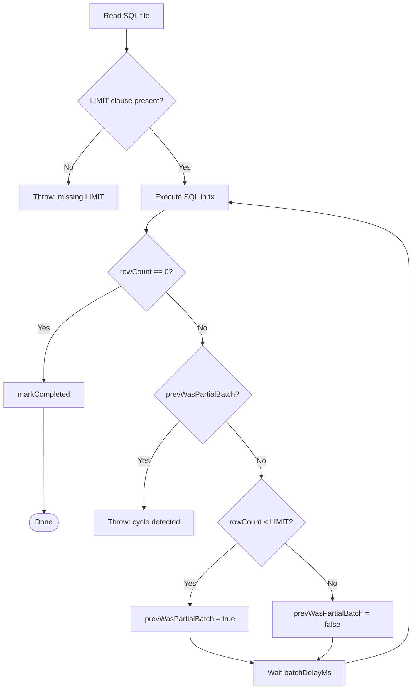
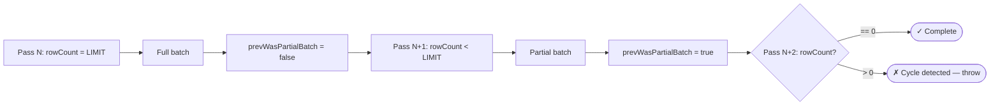
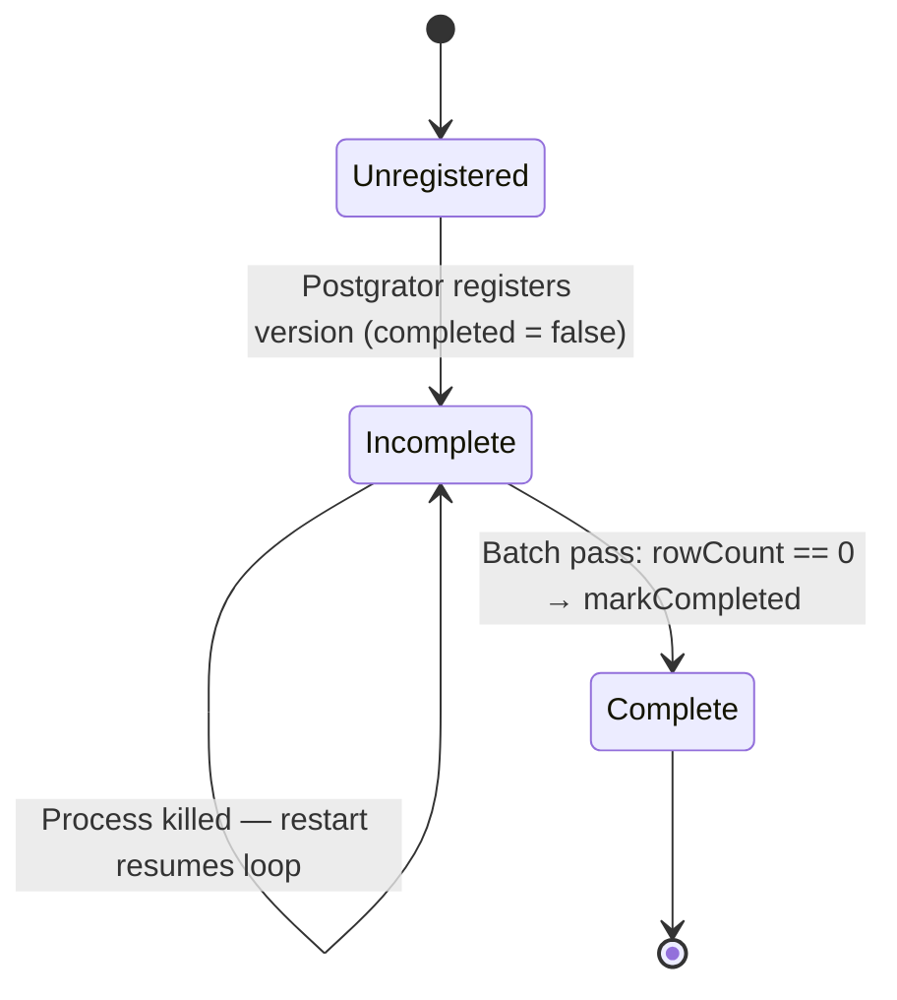
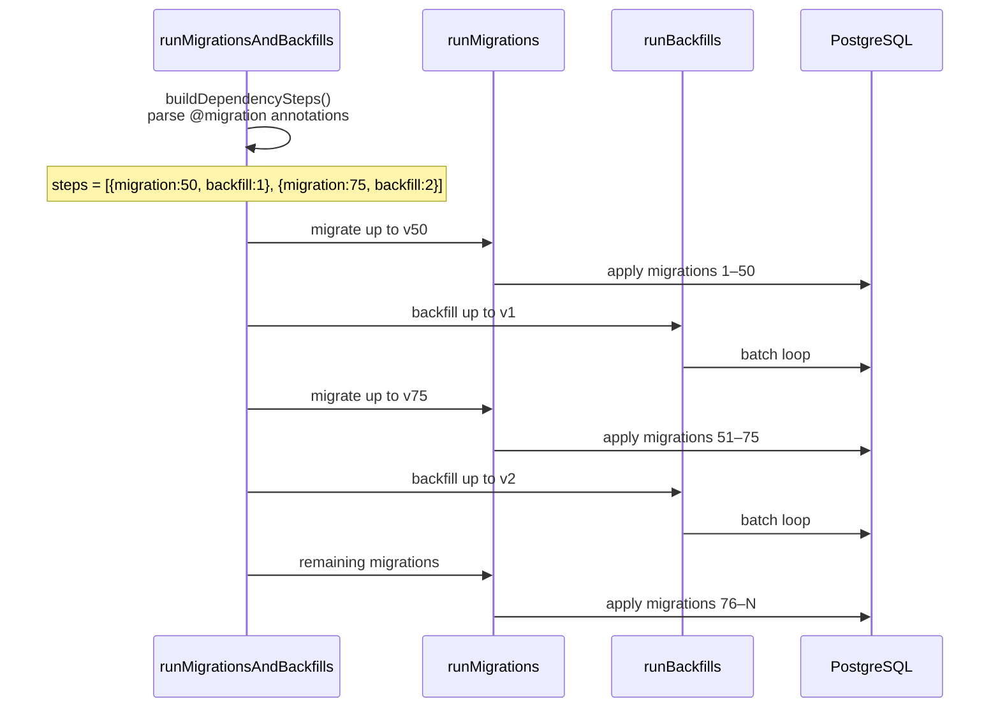
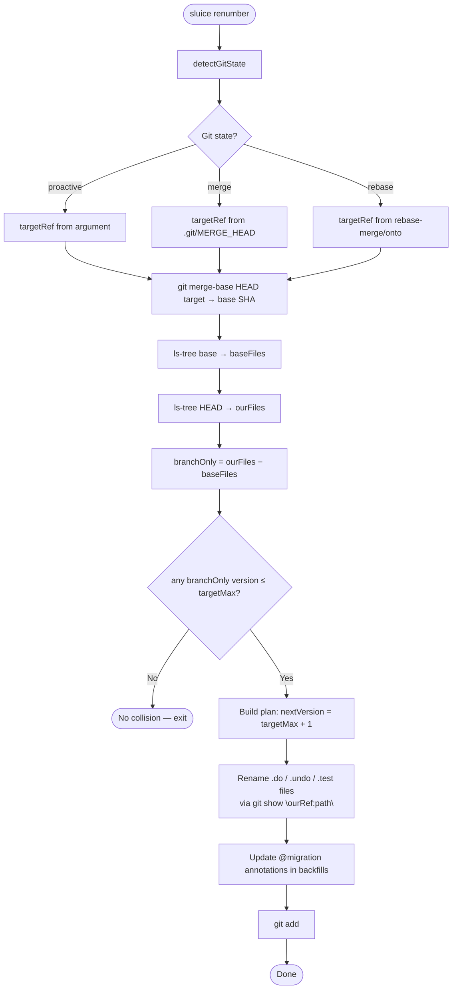
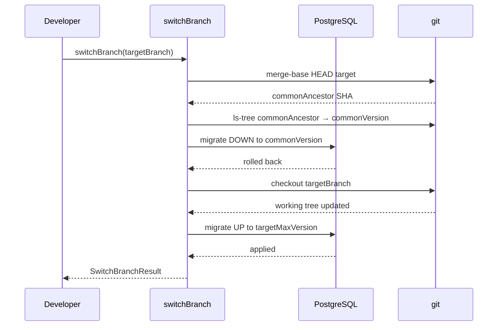

# sluice: A Git-Aware Batched Backfill Runner for PostgreSQL

**Nicholas Adamou — dotbrains**

## Abstract

Production database migrations are well-understood: tools like Flyway, Liquibase, and Postgrator apply versioned SQL scripts in order, track applied versions in a schema table, and roll back on failure. Data backfills — operations that transform existing rows after a schema change — are not. The standard practice is to write a raw SQL script and run it manually, with no batching, no safety rails, no resumability, and no coordination with the migrations they depend on. At small data volumes this works. At millions of rows it causes table locks, hours-long outages, and processes that cannot safely be interrupted.

This paper presents sluice, a TypeScript library and CLI that brings production-grade guarantees to PostgreSQL data backfills. sluice makes five technical contributions: (1) a batched execution model that processes rows in chunks using row-level locks, with configurable inter-batch delay; (2) a cycle-detection invariant that catches broken `WHERE` clauses before they produce infinite loops; (3) resume semantics that restart interrupted batch loops from the exact row set left behind, using an idempotent `WHERE` clause as the continuation mechanism; (4) an annotation-driven interleaving system that parses `-- @migration` comments from backfill SQL files to enforce ordering between schema changes and the data transforms that depend on them; and (5) a git-aware version management layer that detects and resolves migration version collisions between feature branches using git plumbing (`merge-base`, `ls-tree`, `cat-file`), and automates the database state transition when switching branches.

## 1. Introduction

A typical schema migration adds a column, creates an index, or drops a table. These operations are point-in-time and forward-only: the migration tool applies the change once, records the version, and moves on. Data backfills are different. A backfill fills in values for a new column, normalises denormalised rows, or populates a new table from existing data. On a large table, this is not a point-in-time operation: it must run in batches to avoid acquiring table-level locks, it may take hours or days, and the process may be interrupted at any point.

Existing migration tools do not handle this case. Flyway and Liquibase support arbitrary SQL, but they execute each script exactly once inside a single transaction. A backfill that processes 50 million rows inside one transaction holds row-level locks for its entire duration and produces a single, enormous rollback segment. Postgrator, the tool sluice builds on, has the same limitation. The common workaround — a hand-written loop in application code, or a `DO $$` block in PL/pgSQL — is brittle: it has no version tracking, no cycle detection, no observability, and no ability to resume after interruption.

Beyond execution, backfills have a coordination problem. A backfill that fills in a new column must run *after* the migration that adds that column but *before* the migration that makes that column `NOT NULL`. The developer must remember this dependency and enforce it manually. In a monorepo with multiple engineers, this is an accident waiting to happen.

Finally, backfills have a developer workflow problem. When two engineers independently add a migration numbered `050` to separate branches, the conflict cannot be resolved by git alone: the files have different names but the same version number, and Postgrator will refuse to apply both. Today the resolution is manual, imprecise, and easy to get wrong — especially during an in-progress merge or rebase where the working tree is in a conflicted state.

sluice addresses all three problems with a unified tool.

## 2. Background

### 2.1 Schema Migrations

The standard approach to database schema management is the versioned migration: a numbered SQL file that describes a single forward change (and optionally its inverse). A migration tool reads all files in a directory, compares their version numbers to a `schemaversion` table in the database, and applies any unapplied migrations in order. This model, popularised by Rails ActiveRecord Migrations and later formalised in tools like Flyway [1] and Liquibase [2], is well-suited to structural changes (DDL). Each migration is atomic: it either applies completely or rolls back.

Postgrator [3] is a lightweight Node.js migration runner that follows this model. sluice uses Postgrator as its version-tracking backend, wrapping it with a custom execution layer for backfills.

### 2.2 Data Backfills

A *data backfill* (sometimes called a *data migration*) transforms existing rows to satisfy a new invariant introduced by a schema change. Unlike DDL, backfills are:

- **Iterative**: they must process rows in batches to avoid table locks.
- **Long-running**: millions of rows may require thousands of passes over hours or days.
- **Resumable**: if the process crashes, it must restart without re-processing already-transformed rows.
- **Idempotent**: the `WHERE` clause is the idempotency mechanism — rows that already satisfy the new invariant are not selected.

The standard batched CTE pattern in PostgreSQL expresses this naturally:

```sql
WITH batch AS (
  SELECT ctid FROM public.users
    WHERE status IS NULL
    ORDER BY ctid
    FOR UPDATE
    LIMIT 25000
)
UPDATE public.users SET status = 'active'
  FROM batch
  WHERE public.users.ctid = batch.ctid;
```

Each execution processes at most 25,000 rows. When `rowCount` drops to zero, the backfill is complete. `FOR UPDATE` acquires row-level locks only on the selected batch, not the entire table.

### 2.3 Git-Based Development Workflows

Modern software teams use feature branches extensively. Each engineer branches from `main`, makes changes, and opens a pull request. When two engineers independently add a migration to the same version slot, a version collision occurs. The file-naming convention (`001.do.sql`, `002.do.sql`, ...) that makes migration ordering unambiguous within a single branch becomes a source of conflicts across branches.

The standard resolution is for one engineer to manually renumber their migration, update any references, and push again. This is error-prone when done under the pressure of a merge conflict, and it is impossible to automate without inspecting the git history to determine which files were added on which branch.

## 3. Design

sluice is structured around five independently useful components that compose into a complete backfill pipeline.

### 3.1 Batched Execution with Per-Transaction Locking

The core execution model is a batch loop in `runSingleBackfillLoop` (`src/runner.ts`). For each backfill, sluice:

1. Reads the SQL file from disk.
2. Extracts the `LIMIT` value using `parseBatchLimit` (`src/backfill-utils.ts`).
3. Enters an infinite loop, executing the SQL inside an explicit `database.tx(...)` on each pass.
4. After each pass, checks `rowCount`. If zero, marks the version complete and exits.
5. If non-zero, waits `batchDelayMs` milliseconds (default: 200ms) before the next pass.

Each pass runs inside its own transaction. This is a deliberate design choice: row-level locks acquired by `FOR UPDATE` are released at transaction commit, so the database is not locked between passes. The inter-batch delay allows other queries to run and prevents the backfill from consuming the entire I/O budget of the database.

The `LIMIT` clause is required and enforced at parse time. A backfill without a `LIMIT` clause throws before any rows are touched. This is not a recommendation — it is a hard gate.



### 3.2 Cycle Detection via the Partial-Batch Invariant

The most common bug in a batched backfill is a `WHERE` clause that does not exclude already-processed rows. If `UPDATE ... SET status = 'active' WHERE status IS NULL` is used but the update sets `status` to something other than `'active'`, every pass will select the same rows forever.

sluice detects this with a simple invariant: after a *partial batch* (a pass that returned fewer rows than `LIMIT`), the next pass must return zero rows. A partial batch means the table has fewer unprocessed rows than `LIMIT`, so the next full scan must find none. If it finds any, the `WHERE` clause is not excluding already-processed rows. sluice throws immediately with a descriptive error.

```
Backfill 003 (add-status) cycle detected: rows returned after partial batch
```

This invariant has no false positives in practice. The only scenario where it fires incorrectly would be concurrent writes adding new qualifying rows between passes faster than the backfill processes them — a scenario that implies the backfill's `WHERE` clause is not converging, which is itself a bug.

The detection state is a single boolean, `prevWasPartialBatch`, maintained across passes in the batch loop. It adds zero database overhead.



### 3.3 Resume Semantics via the `completed` Column

Postgrator's version table records which migration files have been *started*. sluice extends this table with a `completed` boolean column that records which backfills have *finished* their batch loop.

```sql
ALTER TABLE public.backfillversion
  ADD COLUMN IF NOT EXISTS completed BOOLEAN NOT NULL DEFAULT false;
```

The `completed` column is set to `true` only after `rowCount === 0` on a batch pass. If the process is killed at any point during the loop — after the first pass, after the ten-thousandth, or during the delay between passes — the version record remains with `completed = false`.

On the next run, `resumeIncompleteBackfills` queries for all versions with `completed = false`, finds their SQL files on disk, and re-runs their batch loops. Because the `WHERE` clause is idempotent, already-processed rows are not reselected. Resume is free.

This design separates *registration* (Postgrator's concern) from *completion* (sluice's concern). Postgrator handles version ordering, file discovery, and table creation. sluice handles whether the actual data work is done.



### 3.4 Interleaved Ordering via SQL Annotations

A backfill that populates `users.status` must run after the migration that adds the `status` column. A backfill that reads from `legacy_addresses` must run before the migration that drops that table. This ordering constraint is inherent to the operation, and it belongs in the operation's file.

sluice uses a SQL comment annotation on the first line of each backfill file:

```sql
-- @migration 050.do.add-status-column.sql
```

This annotation declares that the backfill depends on migration `050`. The `buildDependencySteps` function in `src/interleave.ts` parses all backfill files, resolves each annotation to a migration version number, and groups backfills by their dependency. The result is a sequence of `{ migration: N, backfill: M }` steps, sorted in ascending order.

`runMigrationsAndBackfills` then executes these steps in order:

```
migrate to 050 → run backfills that depend on 050
migrate to 075 → run backfills that depend on 075
...
run remaining migrations
```

The annotation lives in the SQL file itself. There is no external configuration file, no YAML manifest, no metadata database. The dependency graph is reconstructed from the files at runtime. This makes the system self-describing: a backfill file is complete documentation of both what it does and what it requires.

The interleaving logic handles partial progress: if migrations are already ahead of backfills (e.g., a previous interrupted run), the dependency steps that have already been satisfied are skipped via version comparison, and execution resumes at the first unsatisfied step.



### 3.5 Git-Aware Version Collision Resolution

#### 3.5.1 Problem Statement

When two branches each add a migration with version number `N`, they create a version collision. git can merge the two SQL files syntactically (they have different names), but the migration tool will refuse to apply both: they occupy the same version slot. One branch must be renumbered.

The challenge is determining *which* files need to be renumbered and *to what version*, especially when the renumbering must happen during an active merge or rebase conflict — a state where the working tree is unreliable.

#### 3.5.2 Solution: Git Plumbing Over Working Tree State

`buildRenumberPlan` in `src/renumber.ts` uses git object storage rather than the working tree to determine the state of each branch. The key insight is that `git ls-tree` and `git show` read from committed refs, not the working directory. During a merge conflict, the working tree contains merged/conflicted content; but `git show HEAD:migrations/050.do.sql` always returns the clean version of that file as committed on HEAD.

The algorithm:

1. `git merge-base HEAD <target>` — find the common ancestor commit.
2. `git ls-tree -r --name-only <base> -- migrations/` — list migration files at the common ancestor.
3. `git ls-tree -r --name-only HEAD -- migrations/` — list migration files on the current branch.
4. Compute *branch-only files*: files present in HEAD but absent from the common ancestor. These are the migrations added on this branch.
5. `git ls-tree -r --name-only <target> -- migrations/` — find the max version on the target branch.
6. If any branch-only file has a version ≤ target max, a collision exists.
7. Renumber branch-only files sequentially starting at `targetMax + 1`.

File renaming uses `git show <ourRef>:<path>` to extract clean file content from the correct ref, writes it to the new path, and deletes the old path. This works correctly even when the old path is a merge conflict marker in the working tree.



#### 3.5.3 Three Operating Modes

sluice detects the git state automatically:

- **Proactive mode**: No merge or rebase is in progress. The developer passes a target branch explicitly to pre-empt conflicts. Files are renamed on disk and staged with `git add`.
- **Merge mode**: `.git/MERGE_HEAD` exists. The target ref is read from `MERGE_HEAD`. File content is extracted from our ref (`HEAD`) and the old-numbered files are deleted only if they belong to our branch (not the target's).
- **Rebase mode**: `.git/rebase-merge/onto` or `.git/rebase-apply/onto` exists. The onto ref is the target; `orig-head` is our ref. The undo-file conflict resolution strategy is inverted (`--ours` rather than `--theirs`) because rebase reverses the parent/child relationship relative to merge.

The mode detection reads git's own state files — the same files that `git status` reads — rather than heuristics.

#### 3.5.4 Backfill Annotation Updates

When a migration is renumbered from version `050` to version `067`, any backfill file with `-- @migration 050.do.add-status-column.sql` must be updated to `-- @migration 067.do.add-status-column.sql`. sluice scans the backfills folder for annotation references to old filenames and rewrites them atomically.

### 3.6 Branch-Aware Database State Management

When a developer switches from `feature-A` to `feature-B`, their local database may be at a version that does not exist on `feature-B`. A naive `git checkout` leaves the database and the codebase out of sync.

`switchBranch` in `src/switch-branch.ts` automates the correct sequence:

1. `git merge-base HEAD <target>` — find the common ancestor.
2. Read `git ls-tree` at the common ancestor to find the max migration version at the fork point.
3. Migrate the database **down** to that common version using Postgrator's rollback path.
4. `git checkout <target>` — switch branches.
5. Read migration files now on disk (the target branch's files) and migrate **up** to the new max.

The down-migration uses the `.undo.sql` files that Postgrator supports. Developers who write undo files get safe branch switching for free. The `--dry-run` flag shows the planned version transitions without touching the database or the working tree.



## 4. Implementation

sluice is implemented in TypeScript targeting CommonJS Node.js. It is published as `@dotbrains/sluice` on GitHub Packages. `pg-promise` is a peer dependency: sluice accepts an existing database instance rather than creating its own connection pool, avoiding duplicate pools and version mismatches in consuming applications.

The `Database` interface (`src/types.ts`) is a structural subset of `pg-promise`'s `IDatabase` type, requiring only the seven methods sluice actually calls (`none`, `one`, `manyOrNone`, `result`, `query`, `task`, `tx`). Any object that satisfies this interface is accepted. This makes sluice testable without pg-promise and composable with any future Node.js PostgreSQL driver that provides the same methods.

Session-level GUCs for trigger bypass are set on a pinned connection via `database.task(...)`, which holds a single physical connection from the pool for the entire backfill run. GUCs are reset in a `finally` block before the connection is returned to the pool, preventing GUC state from leaking to other queries.

The CLI (`src/cli.ts`) is built with Node.js's built-in argument parsing. There are no external CLI framework dependencies. The CLI reads `DATABASE_URL`, `SLUICE_GUCS`, and `SLUICE_BATCH_DELAY_MS` from the environment and delegates to the library functions.

## 5. Testing

### 5.1 Unit Tests

32 unit tests cover the core logic without requiring a database or network.

`parseBatchLimit` is tested against valid SQL with `LIMIT` in various positions, SQL without a `LIMIT` clause, and SQL with `LIMIT` in comments. The regex `/LIMIT\s+(\d+)/i` is intentionally case-insensitive to handle both uppercase and lowercase SQL conventions.

`buildDependencySteps` is tested against backfill directories with multiple annotations, annotations pointing to the same migration, and annotations pointing to non-existent migrations (which must throw). The sorting invariant — steps must be in ascending migration order — is verified explicitly.

`buildRenumberPlan` is tested using temporary git repositories constructed in the test body. Each test creates a real git repo with a fixture set of migration files, commits them to separate branches, and verifies the plan output. This approach tests the git plumbing integration without mocking `execSync`.

### 5.2 Integration Tests

9 integration tests run against a real PostgreSQL instance managed by [testcontainers](https://node.testcontainers.org/) (`postgres:16-alpine`). Each test creates a fresh temporary database schema and drops it after the test body, providing full isolation.

`runner.db.test.ts` tests the batch loop end-to-end: a table with 100 rows is backfilled with a `LIMIT 25` backfill, producing four passes. Idempotent re-runs complete instantly (zero passes). Cycle detection throws with the correct error message. Missing `LIMIT` throws before any rows are touched. Resume after interruption re-runs only the incomplete batch loop.

`interleave.db.test.ts` tests the full interleaved pipeline from an empty database: migrations and backfills are applied in the correct order, intermediate database state is verified after each step, and idempotent re-runs produce no changes.

### 5.3 Cross-Context IPC for testcontainers

vitest's `globalSetup` runs in a separate Node.js context from test workers. Environment variables set in `globalSetup` do not propagate to test files. sluice solves this with a JSON state file (`test/.pg-container-state.json`) written by `globalSetup` and read by `db-test-utils.ts`. The file is created before any test worker starts and deleted after all tests complete. This is the most reliable cross-context IPC approach in vitest.

## 6. Related Work

**Flyway** [1] and **Liquibase** [2] are the dominant schema migration tools in the JVM ecosystem. Both support SQL and Java-based migrations, versioned by filename. Neither supports batched re-execution, resume semantics, or git-aware version management.

**Sqitch** [4] is a change-management system that tracks dependencies between migrations explicitly, using a `sqitch.plan` file rather than filename ordering. This is conceptually similar to sluice's `@migration` annotation, but Sqitch operates at the schema level, not the data level.

**golang-migrate** [5] is a widely used Go migration library with a similar filename convention to Postgrator. It supports multiple database backends but has no backfill-specific features.

**Django migrations** [6] and **ActiveRecord migrations** [7] are ORM-integrated migration systems that auto-generate migration files from model changes. Both have `RunPython`/`execute` escape hatches for data migrations, but these are single-execution: no batching, no resume.

**pg-boss** [8] is a PostgreSQL-backed job queue for Node.js. Long-running backfills could be modelled as jobs, but pg-boss provides no SQL templating, no version tracking, and no git coordination.

None of the above tools address the combination of batched execution, cycle detection, resumability, annotation-driven ordering, and git-aware version management that sluice provides.

## 7. Limitations and Future Work

**Rollback backfills.** sluice does not support reversing a completed backfill. The design assumption is that backfill SQL is idempotent and forward-only. A rollback would require a new backfill file. This is intentional but limits use in environments where reversibility is required.

**Multi-database coordination.** sluice operates on a single PostgreSQL connection string per run. Cross-database or cross-schema backfills are out of scope.

**Non-SQL backfills.** The CLI enforces that backfill files must be `.sql`. The programmatic API accepts any file that Postgrator can execute (`.js`, `.mjs`, `.cjs`), but the batch loop and cycle detection require a `LIMIT` clause in the SQL content. JavaScript-based backfills cannot use the batch loop.

**Distributed execution.** In environments with multiple application instances running simultaneously, two instances could execute the same backfill concurrently. Advisory locks or a distributed coordination mechanism would be needed to prevent this. sluice does not currently implement any concurrency control beyond row-level locking within a single run.

**Automatic `@migration` generation.** The `@migration` annotation must be written manually. A future tool could analyse SQL ASTs to infer which schema objects a backfill depends on and suggest the correct annotation automatically.

## 8. Conclusion

sluice addresses a gap between schema migration tooling and the practical needs of production data backfills. The key insight is that batched idempotent SQL, combined with a completion flag in the version table, provides a simple and robust model for resumable, long-running data transforms. The `@migration` annotation extends this model to multi-step pipelines where schema changes and data transforms must be interleaved in a specific order. The git plumbing layer extends it further to multi-branch development workflows where version collisions and database state divergence are everyday occurrences.

Each component is independently useful: the batch loop can be used without the interleaving system; the renumber command can be used without any backfills. Composed together, they eliminate the entire class of manual steps that developers currently perform when deploying schema-coupled data changes to production.

## References

[1] Axel Fontaine. *Flyway*. https://flywaydb.org

[2] Nathan Voxland and Matt Revell. *Liquibase*. https://www.liquibase.org

[3] Rick Bergfalk. *Postgrator*. https://github.com/rickbergfalk/postgrator

[4] David E. Wheeler. *Sqitch*. https://sqitch.org

[5] *golang-migrate*. https://github.com/golang-migrate/migrate

[6] Django Software Foundation. *Django Migrations*. https://docs.djangoproject.com/en/stable/topics/migrations/

[7] Ruby on Rails. *Active Record Migrations*. https://guides.rubyonrails.org/active_record_migrations.html

[8] Tim Jones. *pg-boss*. https://github.com/timgit/pg-boss

*sluice is available at https://github.com/dotbrains/sluice under the MIT License.*
