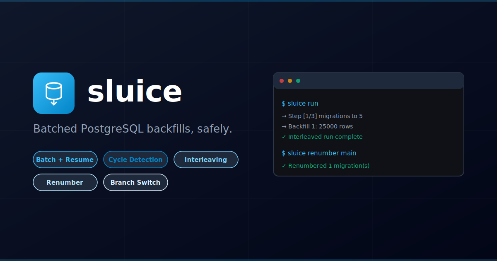

# sluice — Batched PostgreSQL Backfill Runner



[](https://github.com/dotbrains/sluice/actions/workflows/ci.yml)
[](https://github.com/dotbrains/sluice/packages)
[](https://opensource.org/licenses/MIT)


Batched PostgreSQL data backfills with cycle detection, resume-from-interruption, migration interleaving, version collision renumbering, and safe database branch switching.

## Quick Start

```sh
# Install (see Installation section for registry setup)
npm install @dotbrains/sluice pg-promise

# Set connection string
export DATABASE_URL=postgres://localhost:5432/myapp

# Run backfills
npx sluice backfill --folder=./backfills

# Run migrations
npx sluice migrate --folder=./migrations

# Run interleaved migrations + backfills
npx sluice run --migrations=./migrations --backfills=./backfills

# Renumber branch migrations to avoid version collisions
npx sluice renumber main --migrations=./migrations

# Safely switch database to another git branch
npx sluice switch feature-branch --migrations=./migrations
```

```typescript
import pgPromise from 'pg-promise';
import { runBackfills, runMigrations, runMigrationsAndBackfills } from '@dotbrains/sluice';

const pgp = pgPromise();
const db = pgp('postgres://localhost:5432/myapp');

// Run backfills only
await runBackfills({
  database: db,
  backfillsFolder: './backfills',
  gucs: ['myapp.is_backfill'],
});

// Run migrations only
await runMigrations({
  database: db,
  migrationsFolder: './migrations',
});

// Run interleaved migrations + backfills
await runMigrationsAndBackfills({
  database: db,
  migrationsFolder: './migrations',
  backfillsFolder: './backfills',
  gucs: ['myapp.is_backfill'],
});
```

## How It Works

**Backfill runner:**
1. Reads SQL files using the batched CTE pattern (each must have a `LIMIT` clause).
2. Executes in a transaction, checks `rowCount`. If rows were affected, waits `batchDelayMs` and re-executes.
3. When `rowCount === 0`, marks the version complete and moves to the next backfill.
4. Detects infinite loops (cycle detection) and resumes from interruptions automatically.

**Interleaved mode:**
1. Parses `-- @migration <file>` annotations from backfill files.
2. Groups backfills by their prerequisite migration.
3. Executes in order: migrate to N → run backfills for N → repeat → run remaining migrations.

**Renumber:**
1. Detects migration version collisions between branches using `git merge-base` and `git ls-tree`.
2. Renumbers branch-only migrations above the target's max version.
3. Updates `@migration` annotations in backfill files.
4. Works proactively or during merge/rebase conflicts.

**Switch branch:**
1. Finds the common ancestor between HEAD and target.
2. Migrates database down to the common version, checks out the target, migrates up.

## Installation

This package is published to [GitHub Packages](https://github.com/dotbrains/sluice/packages). Configure the `@dotbrains` scope first:

```sh
# .npmrc (project root or ~/.npmrc)
@dotbrains:registry=https://npm.pkg.github.com
```

Then install:

```sh
npm install @dotbrains/sluice pg-promise
```

`pg-promise` is a peer dependency — you provide your own database instance.

## Commands

| Command | Description |
|---|---|
| `sluice backfill --folder=<path> [version]` | Run backfills to completion |
| `sluice migrate --folder=<path> [version]` | Run schema migrations forward |
| `sluice run --migrations=<path> --backfills=<path>` | Run interleaved migrations + backfills |
| `sluice renumber [target] --migrations=<path>` | Renumber branch migrations to avoid collisions |
| `sluice switch <target> --migrations=<path>` | Safely switch database to a different branch |

## Writing Backfills

Every backfill is a `.sql` file using the batched CTE pattern:

```sql
-- @migration 050.do.add-status-column.sql

WITH batch AS (
  SELECT ctid FROM public.users
    WHERE status IS NULL
    ORDER BY ctid
    FOR UPDATE
    LIMIT 25000
)
UPDATE public.users SET status = 'active'
  FROM batch
  WHERE public.users.ctid = batch.ctid;
```

Rules:
1. **LIMIT is required** — sluice rejects backfills without one.
2. **WHERE must exclude processed rows** — if a row matches after update, sluice detects the cycle and throws.
3. **`@migration` annotation** — first line declares the prerequisite migration (required for interleaved mode).
4. **Idempotent** — if all rows are processed, the CTE returns 0 rows and completes instantly.

See `templates/backfill.md` for the full template.

## Configuration

```sh
export DATABASE_URL=postgres://localhost:5432/myapp
export SLUICE_GUCS=myapp.is_backfill       # optional: bypass triggers
export SLUICE_BATCH_DELAY_MS=200            # optional: pause between batches
```

Trigger bypass sets PostgreSQL GUC values at session level. Individual backfills can re-enable triggers with `SET LOCAL`:

```sql
SET LOCAL "myapp.is_backfill" = 'false';
WITH batch AS ( ... )
```

See [SPEC.md](SPEC.md) for the full API reference, architecture diagrams, and design decisions.

## Paper

A technical paper describing sluice's design and contributions is available in the repo:

[**PAPER.md**](PAPER.md) — covers the batched execution model, cycle-detection invariant, resume semantics, annotation-driven interleaving, and git-aware version management, with comparisons to related tools (Flyway, Liquibase, Sqitch, golang-migrate, Django migrations).

## Dependencies

- **[PostgreSQL](https://www.postgresql.org/)** — target database
- **[pg-promise](https://github.com/vitaly-t/pg-promise)** — database driver (peer dependency)
- **[git](https://git-scm.com/)** — required for `renumber` and `switch` commands

## License

MIT
