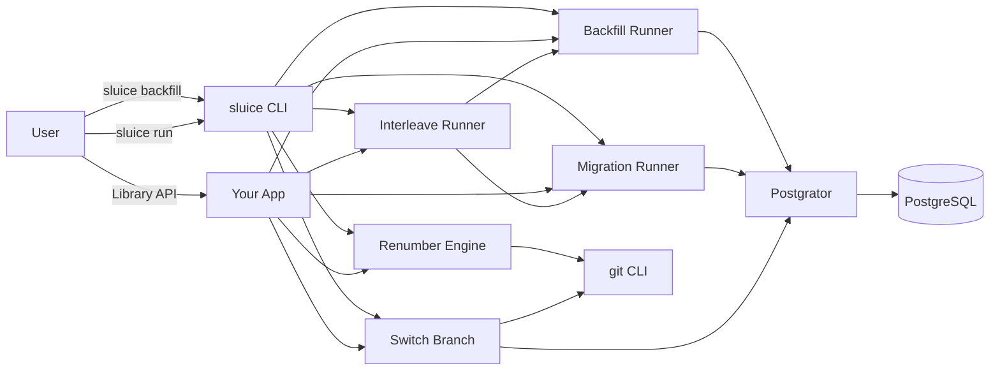
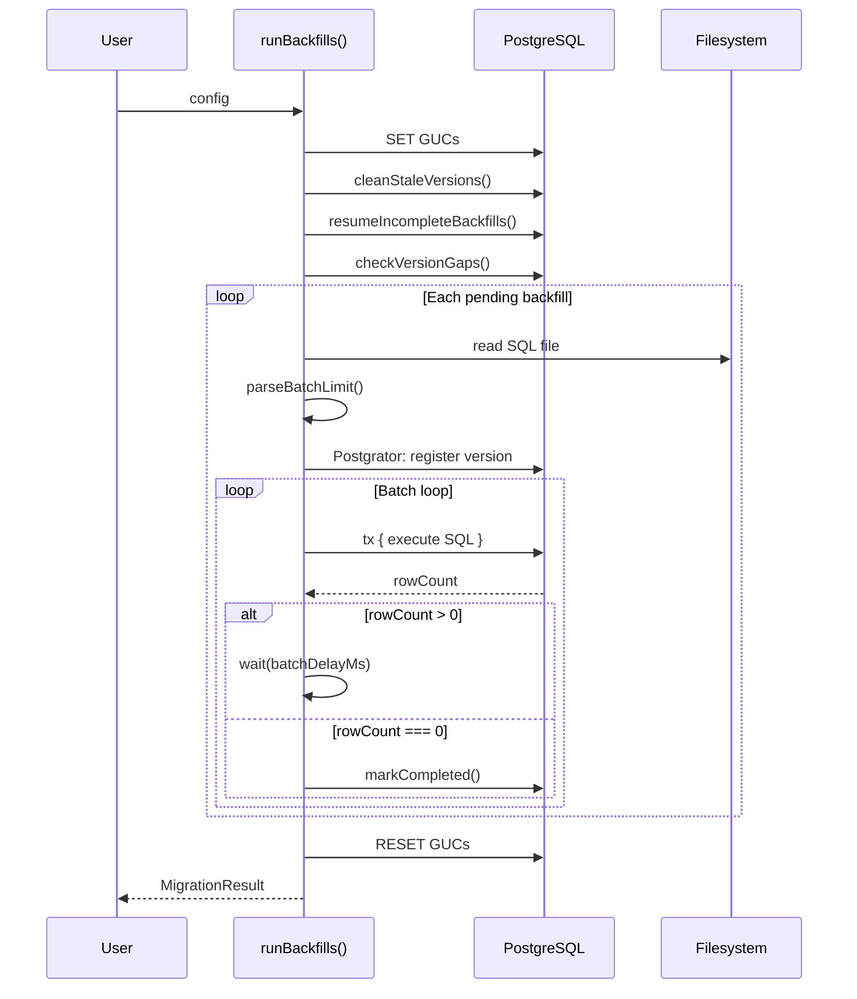
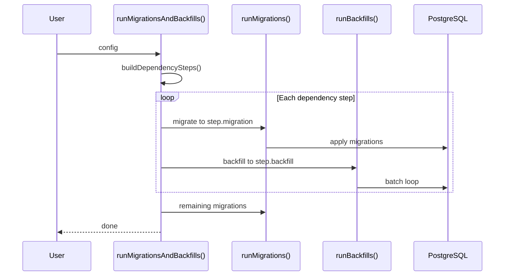
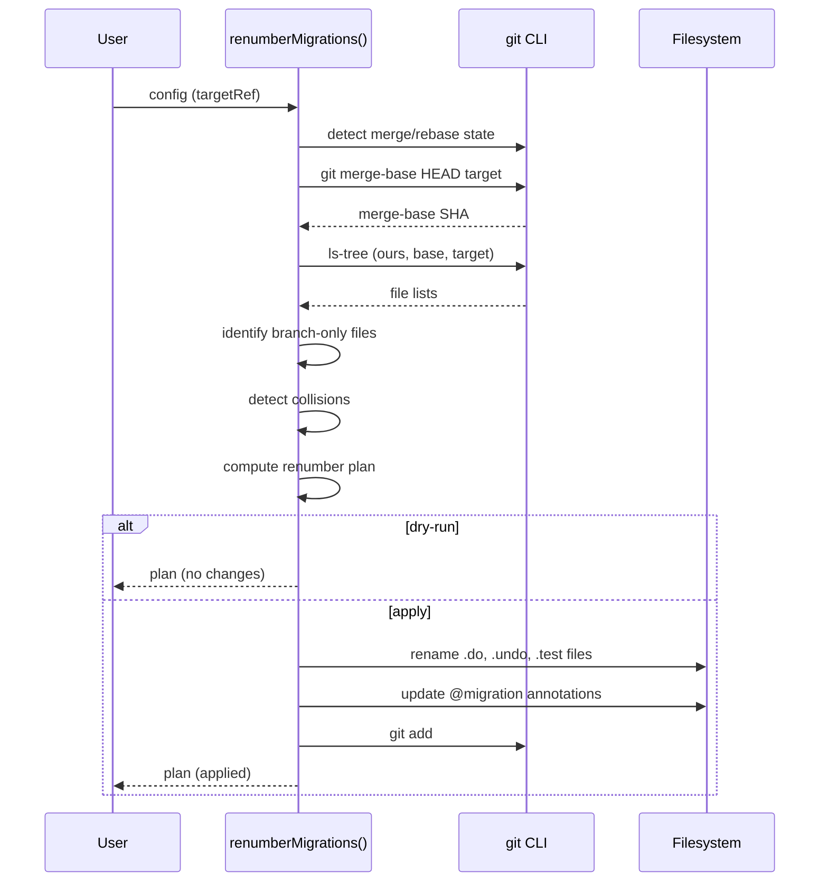

# sluice — Batched PostgreSQL Backfill Runner


[](https://github.com/dotbrains/sluice/actions/workflows/ci.yml)
[](https://opensource.org/licenses/MIT)


A production-grade library and CLI for running batched PostgreSQL data backfills with cycle detection, resume-from-interruption, migration interleaving, version collision renumbering, and safe database branch switching. Built on [Postgrator](https://github.com/rickbergfalk/postgrator) for version tracking.

## Problem

Schema migrations change your database structure. Backfills transform your data. Most migration tools handle the first part well but leave backfills as an afterthought — a raw SQL script you run manually and hope it doesn't lock your tables for hours.

When a backfill processes millions of rows, you need:

- **Batching** — process rows in chunks with row-level locks, not table locks.
- **Resumability** — if the process dies mid-backfill, the next run picks up where it left off.
- **Safety rails** — missing LIMIT clauses or broken WHERE clauses that loop forever should be caught before they cause damage.
- **Ordering** — backfills that depend on schema changes must run after their prerequisite migrations.
- **Branch coordination** — developers switching branches need their database state to match, and version collisions at merge time should be resolved automatically.

`sluice` solves all of these.

## Configuration

### Environment Variables

| Variable | Description | Default |
|---|---|---|
| `DATABASE_URL` | PostgreSQL connection string | required |
| `SLUICE_GUCS` | Comma-separated GUC names to set during backfills | `""` |
| `SLUICE_BATCH_DELAY_MS` | Delay between batch passes in ms | `200` |

### Programmatic Configuration

All runner functions accept a config object. See the [Public API](#public-api) section for full type definitions.

## Commands

### `sluice backfill --folder=<path> [version]`

Run all pending backfills to completion.

Steps:
1. Sets session-level GUCs (from `SLUICE_GUCS`) on a pinned connection.
2. Cleans stale version records from branch switching.
3. Resumes any incomplete backfills from prior interrupted runs.
4. Checks for version gaps.
5. For each pending backfill version (in order):
   a. Runs Postgrator to register the version (creates tracking table on first run).
   b. Reads the SQL file and extracts the `LIMIT` value.
   c. Executes the SQL in a transaction, checks `rowCount`.
   d. If `rowCount > 0`, waits `batchDelayMs`, then re-executes.
   e. If `rowCount === 0`, marks the version as completed.
6. Resets GUCs and returns the connection to the pool.

### `sluice migrate --folder=<path> [version]`

Run schema migrations forward to the target version (or latest).

Steps:
1. Discovers all local migration files using `fast-glob`.
2. Runs Postgrator to apply all pending migrations up to the target version.
3. On failure, rolls back to the starting version.
4. Returns a `MigrationResult` with start, end, and target versions.

### `sluice run --migrations=<path> --backfills=<path>`

Run migrations and backfills in interleaved order based on `@migration` annotations.

Steps:
1. Parses `@migration` annotations from all backfill files.
2. Groups backfills by their target migration version.
3. For each dependency step:
   a. Run migrations up to N.
   b. Run backfills that depend on migration N.
4. Run remaining migrations after the last step.

This prevents the classic failure: migration drops a column that a backfill still needs to read.

### `sluice renumber [target-branch] --migrations=<path> [--backfills=<path>] [--dry-run]`

Detect and resolve migration version collisions between the current branch and a target branch.

Steps:
1. Detects git state (proactive, in-progress merge, or in-progress rebase).
2. Finds the merge-base between HEAD and the target.
3. Identifies branch-only migrations (in ours but not in the common ancestor).
4. If any branch-only versions collide with the target's max version, computes a renumbering plan.
5. Renames `.do.sql`, `.undo.sql`, and colocated `.test.ts` files.
6. Updates `-- @migration` annotations in backfill files.
7. Stages changes with `git add`.

Works in three modes:
- **proactive** — pass a target branch to fix versions before merging.
- **merge** — auto-detects an in-progress `git merge` via `.git/MERGE_HEAD`.
- **rebase** — auto-detects an in-progress `git rebase` via `.git/rebase-merge/` or `.git/rebase-apply/`.

### `sluice switch <target-branch> --migrations=<path> [--dry-run]`

Safely switch the database and working tree to a different git branch.

Steps:
1. Finds the merge-base between HEAD and the target branch.
2. Migrates the database **down** to the common ancestor's max migration version.
3. Runs `git checkout <target-branch>`.
4. Migrates the database **up** to the target branch's latest version.

### Global Flags

| Flag | Description |
|---|---|
| `--folder`, `-f` | Path to migration or backfill SQL files |
| `--migrations` | Path to migration SQL files (for `run`, `renumber`, `switch`) |
| `--backfills` | Path to backfill SQL files (for `run`, `renumber`) |
| `--dry-run` | Show plan without making changes (`renumber`, `switch`) |
| `-h`, `--help` | Show help |

## Writing Backfills

Every backfill is a `.sql` file using the batched CTE pattern:

```sql
-- @migration 050.do.add-status-column.sql

WITH batch AS (
  SELECT ctid FROM public.users
    WHERE status IS NULL
    ORDER BY ctid
    FOR UPDATE
    LIMIT 25000
)
UPDATE public.users SET status = 'active'
  FROM batch
  WHERE public.users.ctid = batch.ctid;
```

### Rules

1. **LIMIT is required** — sluice rejects backfills without one.
2. **WHERE must exclude processed rows** — the `UPDATE SET` must fully satisfy the `WHERE` filter. If a row matches after being updated, sluice detects the cycle and throws.
3. **`@migration` annotation** — first line declares which migration this backfill depends on (required for interleaved mode).
4. **Idempotent by design** — the `WHERE` clause is the idempotency mechanism. If all rows are already processed, the CTE returns 0 rows and the backfill completes instantly.

## How It Works

### Batch Loop

For each backfill, sluice:

1. Runs Postgrator to register the version (creates the tracking table on first run).
2. Reads the SQL file and extracts the `LIMIT` value.
3. Executes the SQL in a transaction, checks `rowCount`.
4. If `rowCount > 0`, waits `batchDelayMs`, then re-executes.
5. If `rowCount === 0`, marks the version as completed.
6. Moves to the next backfill.

### Cycle Detection

After a partial batch (fewer rows than the LIMIT), the next execution must return 0 rows. If it returns rows again, the `WHERE` clause isn't excluding already-processed rows — sluice throws immediately.

### Resume from Interruption

Each backfill version is tracked with a `completed` boolean in the `backfillversion` table. If the process is killed mid-loop, the version remains `completed = false`. On the next run, sluice finds incomplete versions and re-runs their batch loops.

### Interleaved Mode

The `@migration` annotation on each backfill declares its prerequisite migration. `runMigrationsAndBackfills` parses these annotations, groups backfills by their target migration, and executes in order:

1. Run migrations up to N.
2. Run backfills that depend on migration N.
3. Repeat for the next group.
4. Run remaining migrations.

### Trigger Bypass

Configure GUCs to set PostgreSQL GUC values at session level:

```typescript
await runBackfills({
  database: db,
  backfillsFolder: './backfills',
  gucs: ['myapp.is_backfill'],
});
```

This executes `SET "myapp.is_backfill" = 'true'` on a pinned connection before any backfills run. Individual backfills can re-enable triggers with `SET LOCAL`:

```sql
SET LOCAL "myapp.is_backfill" = 'false';
WITH batch AS ( ... )
```

### Stale Version Cleanup

When switching branches during development, the `backfillversion` table may contain records for files that no longer exist on the current branch. `cleanStaleVersions` removes these records before running new backfills, preventing version conflicts and stale max-version inflation.

### Version Gap Detection

After stale version cleanup and resume, `checkVersionGaps` compares the set of applied versions in the database against local backfill files. If any versions below the max applied are missing, an error is logged (indicates data corruption or unexpected manual intervention).

### Renumbering

When two branches independently add migrations with the same version number, `sluice renumber` resolves the collision:

1. Uses `git merge-base` to find the common ancestor.
2. Uses `git ls-tree` to list migration files at each ref.
3. Identifies branch-only files (present in ours, absent from the common ancestor).
4. If any branch-only version ≤ target's max, renumbers them sequentially starting at `targetMax + 1`.
5. Renames `.do.sql`, `.undo.sql`, and `.test.ts` files.
6. Scans backfill files for `-- @migration` annotations referencing the old filenames and updates them.
7. During merge/rebase: extracts file content from the correct ref (`git show`) to handle conflicted working trees.

### Branch Switching

`sluice switch` automates the database state transition when changing git branches:

1. `git merge-base HEAD <target>` → common ancestor.
2. `git ls-tree` at the common ancestor → max migration version at the fork point.
3. `migrate(database, folder, 'migration', commonVersion)` → roll back to common.
4. `git checkout <target>`.
5. Read migration files on disk (now the target branch's files) → `migrate` up to max on disk.

## Public API

### Types

```typescript
interface Logger {
  info(message: string, meta?: Record<string, unknown>): void;
  warn(message: string, meta?: Record<string, unknown>): void;
  error(message: string, meta?: Record<string, unknown>): void;
  debug(message: string, meta?: Record<string, unknown>): void;
}

interface Database {
  none(query: string, values?: unknown): Promise<void>;
  one<T = unknown>(query: string, values?: unknown): Promise<T>;
  manyOrNone<T = unknown>(query: string, values?: unknown): Promise<T[]>;
  result(query: string, values?: unknown): Promise<{ rowCount: number }>;
  query(query: string, values?: unknown): Promise<unknown[]>;
  task<T>(cb: (t: Database) => Promise<T>): Promise<T>;
  tx<T>(cb: (t: Database) => Promise<T>): Promise<T>;
}

type RunnerType = 'migration' | 'backfill';

type MigrationMetadata = Pick<Postgrator.Migration, 'version' | 'action' | 'name'> &
  Partial<Postgrator.Migration>;

type LocalMigration = MigrationMetadata & {
  filePath: string;
};

interface MigrationResult {
  startVersion?: number;
  targetVersion: number;
  endVersion: number;
  failedMigration?: MigrationMetadata;
  error?: unknown;
}
```

### Runners

```typescript
// Run all pending backfills to completion.
function runBackfills(config: BackfillRunnerConfig): Promise<MigrationResult>;

interface BackfillRunnerConfig {
  database: Database;
  backfillsFolder: string;
  targetVersion?: number;     // defaults to max on disk
  gucs?: string[];            // GUC names to set to 'true'
  batchDelayMs?: number;      // default: 200
  logger?: Logger;            // default: console
}

// Run schema migrations forward.
function runMigrations(config: MigrationRunnerConfig): Promise<MigrationResult>;

interface MigrationRunnerConfig {
  database: Database;
  migrationsFolder: string;
  targetVersion?: number;     // defaults to max on disk
  logger?: Logger;
}

// Run migrations and backfills in interleaved order.
function runMigrationsAndBackfills(config: InterleaveRunnerConfig): Promise<void>;

interface InterleaveRunnerConfig {
  database: Database;
  migrationsFolder: string;
  backfillsFolder: string;
  gucs?: string[];
  batchDelayMs?: number;
  logger?: Logger;
}
```

### Renumber

```typescript
// Detect collisions and renumber branch-only migrations.
function renumberMigrations(config: RenumberConfig): RenumberPlan | null;

// Compute the plan without applying it.
function buildRenumberPlan(config: {
  migrationsFolder: string;
  backfillsFolder?: string;
  targetRef: string;
  ourRef?: string;
}): RenumberPlan | null;

interface RenumberConfig {
  migrationsFolder: string;
  backfillsFolder?: string;
  targetRef: string;
  dryRun?: boolean;
  logger?: Logger;
}

interface RenumberPlan {
  entries: RenumberEntry[];
  backfillUpdates: BackfillAnnotationUpdate[];
  targetMaxVersion: number;
  startVersion: number;
}

interface RenumberEntry {
  oldVersion: number;
  newVersion: number;
  oldDo: string;
  newDo: string;
  oldUndo: string | null;
  newUndo: string | null;
  oldTest: string | null;
  newTest: string | null;
}

interface BackfillAnnotationUpdate {
  filePath: string;
  oldRef: string;
  newRef: string;
}

type GitMode = 'proactive' | 'merge' | 'rebase';
```

### Switch Branch

```typescript
// Safely switch the database and working tree to a different branch.
function switchBranch(config: SwitchBranchConfig): Promise<SwitchBranchResult>;

interface SwitchBranchConfig {
  database: Database;
  migrationsFolder: string;
  targetBranch: string;
  dryRun?: boolean;
  logger?: Logger;
}

interface SwitchBranchResult {
  commonVersion: number;    // version rolled back to
  targetBranch: string;     // branch that was checked out
  finalVersion: number;     // version after migrating up
}
```

### Utilities

```typescript
// Postgrator wrappers
function getCurrentVersion(database: Database, runnerType: RunnerType): Promise<number>;
function getLocalMigrations(folder: string): LocalMigration[];
function getMaxVersion(folder: string, filter?: 'do' | 'undo'): number;
function migrate(database: Database, folder: string, runnerType: RunnerType, to?: number, ...): Promise<MigrationResult>;
function parseFilename(filename: string): MigrationMetadata;

// Backfill helpers
function parseBatchLimit(sql: string): number | null;
function shouldWarnLongRunning(elapsedMs: number, lastWarnTime: number, now: number): boolean;
function cleanStaleVersions(database: Database, folder: string, logger: Logger): Promise<void>;
function checkVersionGaps(database: Database, folder: string, logger: Logger): Promise<void>;
function ensureCompletedColumn(database: Database): Promise<void>;
function markCompleted(database: Database, version: number): Promise<void>;

// Interleave helpers
function parseAnnotation(filePath: string): string;
function buildDependencySteps(backfillsFolder: string, migrationsFolder: string): DependencyStep[];

type DependencyStep = { migration: number; backfill: number };
```

## Architecture



### Runner Pipeline



### Interleave Pipeline



### Renumber Pipeline



## Package Structure

```
sluice/
├── src/
│   ├── types.ts               # Logger, Database, RunnerType, config interfaces, MigrationResult
│   ├── migrations.ts          # Postgrator wrapper: getLocalMigrations, migrate, getCurrentVersion, getMaxVersion, parseFilename
│   ├── backfill-utils.ts      # parseBatchLimit, shouldWarnLongRunning, cleanStaleVersions, checkVersionGaps, ensureCompletedColumn, markCompleted
│   ├── runner.ts              # runBackfills(), runSingleBackfillLoop() — batch loop with cycle detection
│   ├── migration-runner.ts    # runMigrations() — forward-only migration runner
│   ├── interleave.ts          # parseAnnotation(), buildDependencySteps(), runMigrationsAndBackfills()
│   ├── renumber.ts            # buildRenumberPlan(), renumberMigrations() — version collision resolution
│   ├── switch-branch.ts       # switchBranch() — safe database branch switching
│   ├── cli.ts                 # CLI entry point: backfill, migrate, run, renumber, switch commands
│   └── index.ts               # Public API barrel exports
├── test/
│   ├── backfill-utils.test.ts # 16 unit tests: parseBatchLimit, shouldWarnLongRunning, stale version detection
│   ├── interleave.test.ts     # 8 unit tests: parseAnnotation, buildDependencySteps, ascending dependency order
│   ├── renumber.test.ts       # 8 unit tests: collision detection, renumbering plan, undo files, backfill annotations (temp git repos)
│   ├── runner.db.test.ts      # 6 integration tests: batch loop, idempotency, sequential, cycle detection, missing LIMIT, resume
│   ├── interleave.db.test.ts  # 3 integration tests: interleaved run, catch-up, idempotency
│   ├── db-test-utils.ts       # withTestDatabase() — temp database lifecycle, reads testcontainer URL
│   ├── global-setup.db.ts     # vitest globalSetup — starts PostgreSQL testcontainer
│   └── fixtures/              # SQL fixtures for tests
│       ├── batch-loop/
│       ├── cycle-detection/
│       ├── disable-triggers/
│       ├── interleave/
│       │   ├── backfills/
│       │   └── migrations/
│       ├── missing-limit/
│       ├── sequential/
│       └── trigger-override/
├── templates/
│   ├── backfill.md            # Backfill SQL template and explanation
│   └── backfill-test.md       # Backfill test template
├── package.json               # Dependencies, scripts, peer deps
├── tsconfig.json              # TypeScript config (include src + test)
├── tsconfig.build.json        # Build config (src only, emits to dist/)
├── vitest.config.ts           # Unit test config (excludes *.db.test.ts)
├── vitest.config.db.ts        # Integration test config (includes *.db.test.ts, uses globalSetup)
├── .github/workflows/
│   ├── ci.yml                 # CI: typecheck, unit tests, integration tests (Docker), build
│   └── publish.yml            # Publish to GitHub Packages on release
├── SPEC.md                    # This file
├── README.md                  # User-facing documentation
└── LICENSE                    # MIT
```

## Testing Strategy

### Unit Tests (32 tests)

All core logic is tested without requiring a database or network.

| Module | Tests | What's tested |
|---|---|---|
| `backfill-utils` | 16 | `parseBatchLimit` (valid/invalid SQL), `shouldWarnLongRunning` (timing edge cases), stale version detection with duplicate versions |
| `interleave` | 8 | `parseAnnotation` (valid/missing), `buildDependencySteps` (grouping, sorting, nonexistent migration), ascending dependency order |
| `renumber` | 8 | `buildRenumberPlan`: no collisions (null), collision detection, sequential renumbering, undo file handling, backfill annotation detection, `ourRef` override — all using temp git repos with fixture files |

### Integration Tests (9 tests, Docker)

Database tests run against a real PostgreSQL instance spun up via [testcontainers](https://node.testcontainers.org/) (`postgres:16-alpine`). Each test creates a fresh temporary database and drops it after.

| Module | Tests | What's tested |
|---|---|---|
| `runner.db` | 6 | Batch loop processes all rows, idempotent re-run, sequential execution, cycle detection throws, missing LIMIT throws, resume after interruption |
| `interleave.db` | 3 | Interleaved migrations + backfills from empty DB, catch-up when migrations ahead, idempotent re-run |

### Running Tests

```bash
# Unit tests only (no Docker required)
npm run test:unit

# Integration tests (requires Docker)
npm run test:db

# All tests
npm run test:all

# Type checking
npm run typecheck
```

### CI

Tests run on every push to `main`/`master` and all pull requests. The integration test job uses Docker-in-Docker to run testcontainers.

## GitHub Actions

### CI — `.github/workflows/ci.yml`

Triggered on push to `main`/`master` and all pull requests.

**Jobs:**

1. **typecheck**
   - Runs `tsc --noEmit` to verify types without emitting.

2. **test-unit**
   - Matrix: `node: [18, 20, 22]`, `os: [ubuntu-latest, macos-latest]`
   - Runs `npm run test:unit`.

3. **test-integration**
   - Runs on `ubuntu-latest` (Docker required).
   - Steps: checkout → setup Node → install → `npm run test:db`.
   - Uses Docker-in-Docker for testcontainers.

4. **build**
   - Runs `npm run build` to verify the package compiles.

### Publish — `.github/workflows/publish.yml`

Triggered when a GitHub release is published.

**Steps:**
1. Checks out the repo.
2. Sets up Node 20 with the GitHub Packages registry (`https://npm.pkg.github.com`).
3. Runs `npm ci`, `npm run build`, `npm test`.
4. Publishes `@dotbrains/sluice` to GitHub Packages using the built-in `GITHUB_TOKEN`.

Consumers install by configuring the `@dotbrains` scope:

```sh
# .npmrc
@dotbrains:registry=https://npm.pkg.github.com
```

```sh
npm install @dotbrains/sluice pg-promise
```

## Implementation Language

**TypeScript** (CommonJS). Published as `@dotbrains/sluice` on [GitHub Packages](https://github.com/dotbrains/sluice/packages). Library distributes compiled `.js` + `.d.ts` files via `dist/`. CLI entry point at `dist/cli.js`.

Key dependencies:
- **`postgrator@^7.3.0`** — version tracking, schema table management, migration execution.
- **`fast-glob@^3.3.3`** — migration/backfill file discovery (`.sql`, `.js`, `.mjs`, `.cjs`).
- **`dotenv@^16.4.7`** — load `.env` files for CLI usage.
- **`pg-promise`** (peer dep, `>=11.0.0`) — database connection and query execution. Users provide their own instance.

Dev dependencies:
- **`vitest@^3.0.0`** — test runner.
- **`testcontainers`** + **`@testcontainers/postgresql`** — Docker-based PostgreSQL for integration tests.
- **`typescript@^5.7.0`** — compiler.

## Database Tables

sluice uses two Postgrator-managed version tables:

### `public.schemaversion`

Tracks schema migration versions. Managed entirely by Postgrator.

| Column | Type | Description |
|---|---|---|
| `version` | integer | Migration version number |
| `name` | text | Migration name (from filename) |
| `md5` | text | Checksum of the migration file |
| `run_at` | timestamp | When the migration was applied |

### `public.backfillversion`

Tracks backfill versions. Created by Postgrator, extended by sluice.

| Column | Type | Description |
|---|---|---|
| `version` | integer | Backfill version number |
| `name` | text | Backfill name (from filename) |
| `md5` | text | Checksum of the backfill file |
| `run_at` | timestamp | When the backfill was registered |
| `completed` | boolean | Whether the batch loop has finished (added by sluice) |

The `completed` column is added by `ensureCompletedColumn()` on first run. It enables resume-from-interruption: if a backfill version is registered but `completed = false`, the next run re-executes its batch loop.

## Design Decisions

### 1. Postgrator for version tracking, custom batch loop for execution

Postgrator handles the version table, file ordering, and migration registration — things it does well. But Postgrator executes each migration file exactly once, which doesn't work for batched backfills that need to re-execute until `rowCount === 0`. sluice uses Postgrator for registration and then runs its own batch loop for the actual SQL execution.

### 2. pg-promise as a peer dependency

sluice requires a `Database` interface that matches a subset of pg-promise's API (`none`, `one`, `manyOrNone`, `result`, `query`, `task`, `tx`). Rather than bundling a database driver, sluice accepts whatever `pg-promise` instance the consuming application already has. This avoids duplicate connection pools and version conflicts.

### 3. Session-level GUCs on a pinned connection

Trigger bypass is done via PostgreSQL GUCs (`SET "guc_name" = 'true'`) at session level, not per-transaction. This requires a pinned connection (`database.task(...)`) so the same physical connection is used for all backfills in a run. The GUCs are reset in a `finally` block before returning the connection to the pool.

Individual backfills can override with `SET LOCAL` (transaction-scoped) to re-enable triggers for specific operations.

### 4. Cycle detection via partial-batch heuristic

After a partial batch (fewer rows than LIMIT), the next execution must return 0 rows. If it returns rows again, the `WHERE` clause isn't excluding already-processed rows. This catches the most common bug: an `UPDATE SET` that doesn't satisfy the `WHERE` filter's condition. The heuristic is simple, fast, and has no false positives in practice.

### 5. File-based IPC for testcontainers

vitest's `globalSetup` runs in a separate context from test workers. Environment variables set in `globalSetup` don't propagate to test files. sluice uses a JSON state file (`test/.pg-container-state.json`) to pass the container's connection URL from `globalSetup` to `db-test-utils.ts`. This is the most reliable cross-context IPC approach in vitest.

### 6. Renumber via git plumbing, not working tree state

`sluice renumber` uses `git ls-tree`, `git merge-base`, and `git cat-file` to inspect file state at specific refs. This works correctly even during merge/rebase conflicts where the working tree is in an inconsistent state. The alternative (reading files from disk during a conflict) would see merged/conflicted content instead of each branch's clean version.

### 7. Separate version tables for migrations and backfills

Migrations and backfills have different lifecycles: migrations are forward-only (or rollback-on-failure), while backfills are idempotent and resumable. Using separate Postgrator schema tables (`schemaversion` vs `backfillversion`) keeps the version spaces independent and avoids confusion when a migration and backfill share the same version number.

## Non-Goals

- **Schema diffing.** sluice runs migration files in order. It doesn't diff schemas or generate migrations.
- **ORM integration.** sluice works at the SQL file level. No awareness of models or entities.
- **Multi-database.** Single PostgreSQL instance per run. No cross-database coordination.
- **Rollback backfills.** Backfills are forward-only by design. The `completed` flag + idempotent `WHERE` clause handles interruptions. Reversing a backfill requires a new backfill.
- **GUI or web interface.** sluice is a library and CLI. No dashboards.
